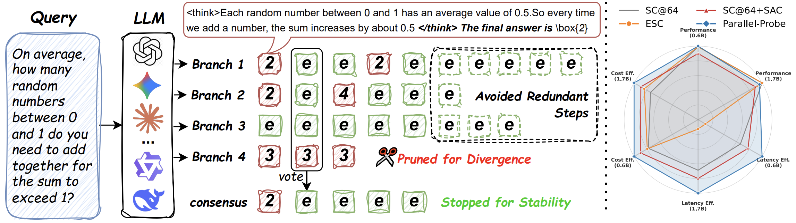
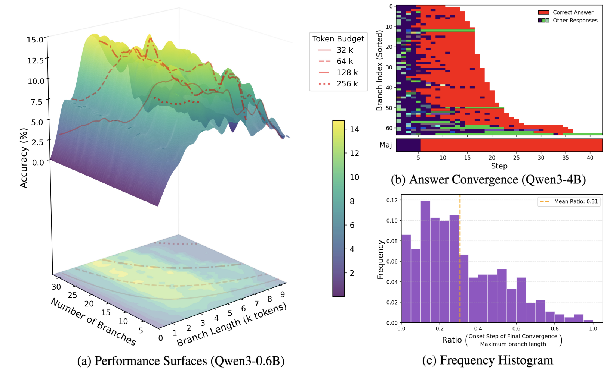

# Parallel-Probe: Towards Efficient Parallel Thinking via 2D Probing


Parallel-Probe is a training-free online controller for efficient parallel reasoning in LLMs.

It introduces **2D Probing**, a lightweight black-box interface that exposes global width–depth dynamics of parallel reasoning, and leverages these dynamics to jointly optimize reasoning width and depth via adaptive pruning and consensus-based early stopping.


---

## Key Contributions

• **2D Probing Interface**  
A structured width × depth probing matrix that reveals global parallel reasoning dynamics during decoding.

• **Dynamics Analysis**  
We uncover three fundamental properties:
  - Non-monotonic width–depth scaling under fixed token budgets  
  - Long-tailed heterogeneous branch lengths  
  - Early stabilization of global consensus  

• **Parallel-Probe Controller**  
A principled training-free policy that:
  - Prunes divergent branches to reduce width  
  - Stops generation once global consensus stabilizes to reduce depth  

• **SCOUT Testbed**  
An offline evaluation framework that decouples trajectory generation from control for fair and efficient test-time scaling research.

[](https://huggingface.co/spaces/EfficientReasoning/efficient_reasoning_online_judgement)


---

## Results

Across multiple models and challenging reasoning benchmarks, Parallel-Probe consistently achieves superior accuracy–efficiency trade-offs, reducing:

- Sequential tokens (latency proxy) by over **30%**
- Total token cost by over **20%**

while maintaining competitive accuracy compared to standard self-consistency baselines.

### Base Model: Qwen3-0.6B

| Method | Type | AIME24 Acc | AIME24 SeqTok | AIME24 Tok | AIME25 Acc | AIME25 SeqTok | AIME25 Tok | HMMT25 Acc | HMMT25 SeqTok | HMMT25 Tok | Avg Acc | Avg SeqTok | Avg Tok |
|-------|------|-----------|--------------|-----------|-----------|--------------|-----------|-----------|--------------|-----------|---------|-----------|--------|
| SC@64 | Parallel | 21.4 | 32.7k | 1008.6k | 28.9 | 31.1k | 890.5k | 18.1 | 31.0k | 937.8k | 22.8 | 31.6k | 945.7k |
| ASC | Seq | 21.4 | 805.5k | 805.5k | 28.9 | 653.8k | 653.8k | 18.1 | 580.8k | 580.8k | 22.8 | 680.0k | 680.0k |
| ESC | Hybrid | 21.4 | 192.9k | 986.7k | 28.9 | 171.8k | 868.8k | 18.1 | 179.5k | 923.9k | 22.8 | 181.4k | 926.5k |
| SC@64+SAC | Parallel | 19.5 | 26.8k | 820.7k | 25.4 | 27.2k | 819.4k | 17.4 | 26.3k | 808.2k | 20.7 | 26.8k | 816.1k |
| **Parallel-Probe** | Parallel | **21.8** | **20.8k** | **773.8k** | **29.7** | **19.6k** | **697.8k** | **18.5** | **20.5k** | **734.5k** | **23.3** | **20.3k** | **735.3k** |

---

### Base Model: Qwen3-1.7B

| Method | Type | AIME24 Acc | AIME24 SeqTok | AIME24 Tok | AIME25 Acc | AIME25 SeqTok | AIME25 Tok | HMMT25 Acc | HMMT25 SeqTok | HMMT25 Tok | Avg Acc | Avg SeqTok | Avg Tok |
|-------|------|-----------|--------------|-----------|-----------|--------------|-----------|-----------|--------------|-----------|---------|-----------|--------|
| SC@64 | Parallel | 72.5 | 31.4k | 1025.8k | 44.4 | 30.0k | 1054.1k | 24.2 | 32.4k | 1132.9k | 47.0 | 31.3k | 1070.9k |
| ASC | Seq | 72.3 | 482.6k | 482.6k | 44.4 | 600.9k | 600.9k | 24.2 | 586.3k | 586.3k | 47.0 | 556.6k | 556.6k |
| ESC | Hybrid | 72.5 | 170.4k | 909.2k | 44.4 | 160.6k | 913.8k | 24.2 | 174.9k | 1014.2k | 47.0 | 168.6k | 945.7k |
| SC@64+SAC | Parallel | 64.5 | 27.3k | 868.2k | 40.0 | 26.4k | 909.0k | 21.4 | 26.9k | 889.1k | 42.0 | 26.9k | 888.8k |
| **Parallel-Probe** | Parallel | **68.1** | **20.5k** | **748.5k** | **44.7** | **21.3k** | **775.8k** | **22.6** | **22.8k** | **860.2k** | **45.1** | **21.5k** | **794.8k** |

---

### Base Model: Qwen3-4B

| Method | Type | AIME24 Acc | AIME24 SeqTok | AIME24 Tok | AIME25 Acc | AIME25 SeqTok | AIME25 Tok | HMMT25 Acc | HMMT25 SeqTok | HMMT25 Tok | Avg Acc | Avg SeqTok | Avg Tok |
|-------|------|-----------|--------------|-----------|-----------|--------------|-----------|-----------|--------------|-----------|---------|-----------|--------|
| SC@64 | Parallel | 80.0 | 29.3k | 886.8k | 76.6 | 30.5k | 1088.1k | 43.6 | 33.9k | 1168.3k | 66.8 | 31.2k | 1047.7k |
| ASC | Seq | 80.0 | 214.2k | 214.2k | 76.6 | 325.1k | 325.1k | 43.6 | 487.3k | 487.3k | 66.7 | 342.2k | 342.2k |
| ESC | Hybrid | 80.0 | 98.9k | 528.9k | 76.6 | 137.0k | 793.3k | 43.6 | 174.0k | 990.2k | 66.8 | 136.6k | 770.8k |
| SC@64+SAC | Parallel | 80.0 | 24.8k | 782.2k | 73.3 | 27.9k | 995.4k | 41.9 | 27.1k | 863.0k | 65.1 | 26.6k | 880.2k |
| **Parallel-Probe** | Parallel | **79.7** | **19.2k** | **688.9k** | **76.1** | **22.2k** | **806.0k** | **44.7** | **21.5k** | **872.3k** | **66.8** | **20.9k** | **789.0k** |

---

### Base Model: Qwen3-8B

| Method | Type | AIME24 Acc | AIME24 SeqTok | AIME24 Tok | AIME25 Acc | AIME25 SeqTok | AIME25 Tok | HMMT25 Acc | HMMT25 SeqTok | HMMT25 Tok | Avg Acc | Avg SeqTok | Avg Tok |
|-------|------|-----------|--------------|-----------|-----------|--------------|-----------|-----------|--------------|-----------|---------|-----------|--------|
| SC@64 | Parallel | 80.4 | 30.1k | 910.8k | 76.7 | 30.7k | 1124.4k | 48.9 | 34.8k | 1267.0k | 68.6 | 31.9k | 1100.7k |
| ASC | Seq | 80.4 | 226.0k | 226.0k | 76.7 | 406.2k | 406.2k | 48.8 | 565.1k | 565.1k | 68.6 | 399.1k | 399.1k |
| ESC | Hybrid | 80.4 | 84.7k | 459.4k | 76.7 | 132.4k | 793.1k | 48.9 | 184.5k | 1062.1k | 68.6 | 133.9k | 771.5k |
| SC@64+SAC | Parallel | 76.7 | 25.6k | 773.4k | 70.2 | 28.1k | 998.5k | 42.7 | 28.5k | 896.8k | 63.2 | 27.4k | 889.5k |
| **Parallel-Probe** | Parallel | **81.5** | **20.3k** | **730.8k** | **76.9** | **21.9k** | **846.7k** | **47.1** | **22.4k** | **897.2k** | **68.5** | **21.6k** | **824.9k** |


---
## Quick Start
This repository includes a partial release of the trajectory data for local evaluation.
For complete benchmarks and large-scale experiments, please use the SCOUT Online Platform (We will support soon).
```bash
pip install pandas & pip install scipy

cd evaluation

python evaluation_main_table.py 


